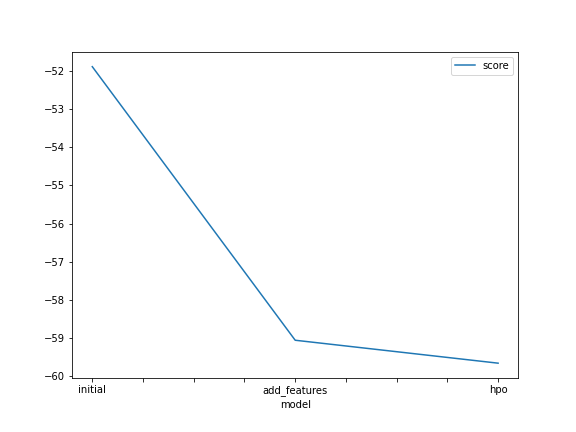
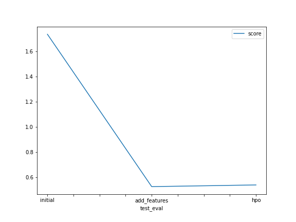

# Report: Predict Bike Sharing Demand with AutoGluon Solution
#### Sohrab Redjai Sani

## Initial Training
### What did you realize when you tried to submit your predictions? What changes were needed to the output of the predictor to submit your results?

The score was not that great for the first submission, which is acceptable for a baseline value. This score was achieved without performing any Exploratory Data Analysis (EDA). 

Also, I've realized that Kaggle does not accept a negative value for the prediction in the submission .csv file. So all of the prediction with the negative score was replaced with zero. 

### What was the top ranked model that performed?
I have trined done the training three times:

- For the model with no hyperparameter turning and no feature engineering, the best performing model was "WeightedEnsemble_L3", with a validation score of -51.884555 
- For the model with no hyperparameter turning and some feature engineering, the best performing model was "WeightedEnsemble_L3", with a validation score of -59.058300 
- For the model with hyperparameter turning and some feature engineering, the best performing model was " LightGBM_BAG_L1/T65", with a validation score of -59.659683

## Exploratory data analysis and feature creation
### What did the exploratory analysis find and how did you add additional features?

Our initial EDA showed that the "weather" and "season" columns contain features that are categorical variables, so we did a one-hot encoding transformation. 

We also extracted information from the date column, such as the month and hour the data was recorded. 

### How much better did your model preform after adding additional features and why do you think that is?

After adding additional features, the model's accuracy was increased from 1.7 to 0.53, which is a substantial improvement. 
## Hyper parameter tuning
### How much better did your model preform after trying different hyper parameters?
The hyperparameters that I've selected to tune did not improve the overall model performance.

### If you were given more time with this dataset, where do you think you would spend more time?
I would try to perform more feature engineering:

- add  day of the week 
- normalize the features
- log the target column

Test more models and vaster hyperparameter space 

### Create a table with the models you ran, the hyperparameters modified, and the kaggle score.
| Model             | initial     | new_features| hpo     
| -----------       | ----------- | ----------- | -----    
| num_epochs        | default     | default     | 10    
| num_boost_round   | default     | default     | 200    
| time              | 600         | 600         | 1200         
| score             | -51.88      | -59.05      | -59.65  

### Create a line plot showing the top model score for the three (or more) training runs during the project.

TODO: Replace the image below with your own.

### Create a line plot showing the top kaggle score for the three (or more) prediction submissions during the project.

TODO: Replace the image below with your own.

## Summary
In this project, we've solved a regression problem to predict the bike-sharing demand based on the available historical data using  AWS AutoGluon 

Our first approach was to train a baseline model without performing feature engineering or parameter tuning.

We've managed to significantly improve the performance of our model by generating and extracting new features.  

I've attempted to do some hyperparameter tuning that did not improve our model performance. 

